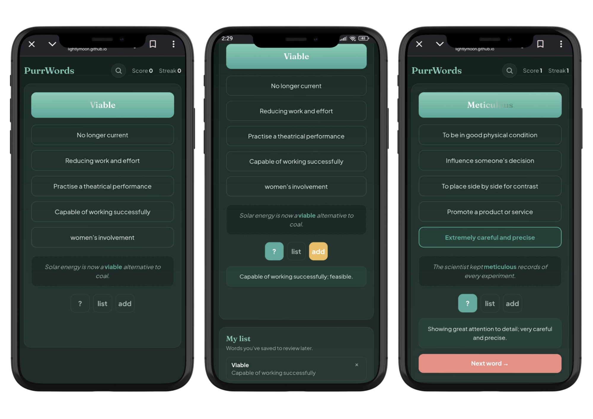
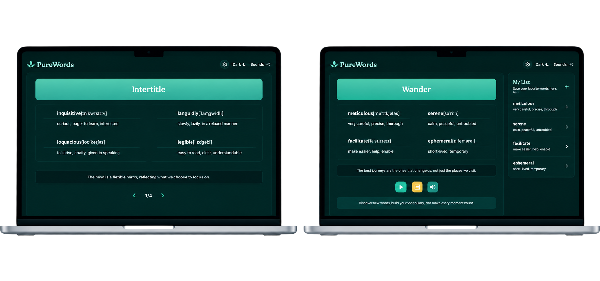

# 🐾 PurrWords

An interactive vocabulary quiz for IELTS prep — built as a lightweight, no-backend web app so anyone can open it, pick an answer, and keep their streak going.

🔗 **Live demo:** [lightlymoon.github.io/purrwords](https://lightlymoon.github.io/purrwords/) <!-- update this if your repo/username differ -->

---

## Screenshots


<p align="center">
  
</p>

<p align="center">
  
</p>


---

## Features

- **Multiple-choice quiz** — five answer options per word, instant right/wrong feedback with animation
- **Example sentences** — see the word used in context, with the target word highlighted
- **Explanations** — an on-demand panel explaining the meaning in more depth
- **Search** — look up any word or phrase directly instead of waiting for it to come up in the quiz
- **My List** — save words you want to review later, remove them anytime
- **Score & streak tracking** — lightweight motivation while you practice
- **Light/dark mode** — follows your system theme automatically
- **Fully responsive** — works on phone, tablet, and desktop

## Tech Stack

- **HTML5** / **CSS3** (custom properties for theming, no framework)
- **Vanilla JavaScript** — no build step, no dependencies
- Fonts: [Fraunces](https://fonts.google.com/specimen/Fraunces) & [Plus Jakarta Sans](https://fonts.google.com/specimen/Plus+Jakarta+Sans) via Google Fonts


## Running Locally

No build tools or installs needed — it's static HTML/CSS/JS.

```bash
git clone https://github.com/lightlymoon/purrwords.git
cd purrwords
```

Then just open `index.html` in your browser, or serve it locally:

```bash
python3 -m http.server 8000
# visit http://localhost:8000
```

## Deployment

This project is deployed with **GitHub Pages** directly from the `main` branch. Any push to `main` updates the live site automatically within a couple of minutes.

## Word List

The vocabulary set is curated for IELTS-level English and lives entirely in `script.js`, so adding new words is as simple as adding a new entry to the array — no other code changes needed.

## Contributing

This started as a personal + friends study tool, but PRs adding new words, fixing bugs, or improving accessibility are welcome.

## License

MIT — free to use, modify, and share.
